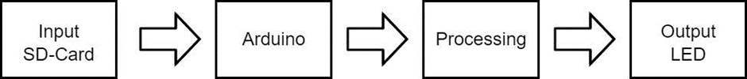
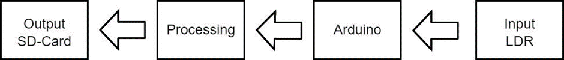
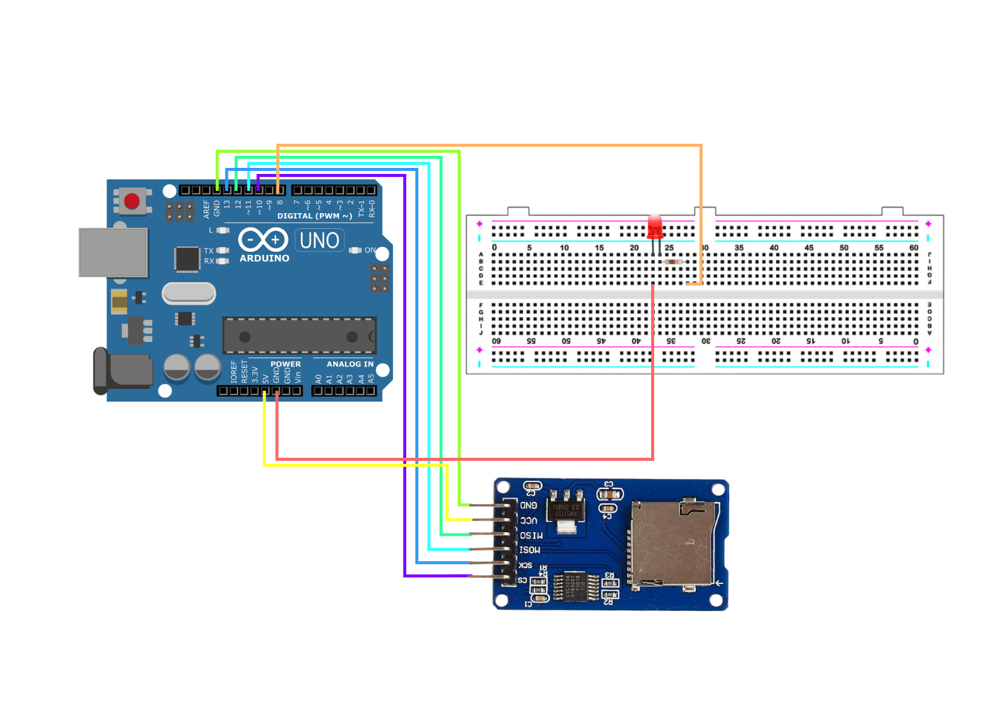
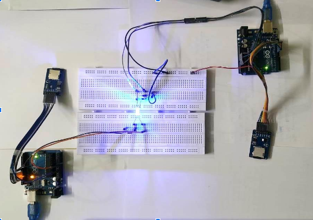

# What is LiFi?
LiFi, short for Light Fidelity, is a wireless communication technology that uses visible light, infrared, or ultraviolet spectrum to transmit data. It offers high-speed, bi-directional networked and mobile communication of data using light.

# How does it work?
LiFi operates by modulating the intensity of light to transmit data. Light-emitting diodes (LEDs) are typically used as the light source. These LEDs can be switched on and off very rapidly, beyond what the human eye can perceive, to encode data. Specialized receivers (photodiodes) are used to detect this light modulation and convert it back into electrical signals, which are then interpreted as data.

# Current Developments
LiFi technology is still in the early stages of adoption but has shown promising developments in various fields. Researchers are exploring methods to improve its range, reliability, and integration with existing communication technologies.

# Hardware Used
   - THE ARDUINO UNO
   - RESISTOR (22 ohm)
   - SD CARD MODULE
   - LED
   - LDR: LIGHT DEPENDENT RESISTOR
   - JUMPER WIRE
   - BREADBOARD

# Software Requestment
   - ARDUINO IDE TOOL
   - ARDUINO IDE LIBRARIES (ElapsedMillis Library, SD Library)
   - C++

# Software Development Model
   - ITERATIVE WATERFALL MODEL

# Block Diagram

   - Transmitter Block Diagram

   - Receiver Block Diagram

# Circuit Diagrams

- Transmitter End

- Receiver End

- Overview Of The Project

# This is a Demo Video Or The Working Of the Project

> Video Link :- https://www.youtube.com/watch?v=2KlDNONzeZ8

